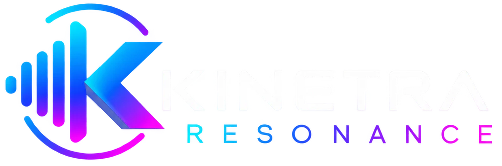

# Kinetra Resonance

**Teleo Music Experience Compiler / Publisher · self-hosted by design**

Kinetra Resonance generates Teleo-compatible music experience data. It processes audio locally, supports human review, compiles the canonical Teleo Music Protocol v1 experience, and exports a static publication bundle. It does not require a central Teleo server: operators can host generated experiences on any compatible HTTPS static host.

<p align="center">
  
  &nbsp;&nbsp;&nbsp;
  <a href="https://github.com/NicoButter/teleo"></a>
  &nbsp;&nbsp;&nbsp;
  <a href="https://vetrabyte.com.ar"></a>
</p>

<p align="center"><strong>Producto de Vetrabyte · desarrollado por Nicolás Butterfield · integrado con PK Teleo</strong></p>

- [Repositorio de PK Teleo](https://github.com/NicoButter/teleo)
- [Vetrabyte](https://vetrabyte.com.ar)

```text
Audio → Kinetra Resonance → Teleo Music Protocol → servidor self-hosted → Teleo
```

## Qué hace hoy

- Carga archivos MP3, WAV, FLAC, M4A, AAC y OGG desde una interfaz Django local.
- Conserva el audio original de forma aislada por UUID.
- Ejecuta `audio-separator` en un proceso local separado de la petición web.
- Detecta y registra únicamente los stems producidos: vocals, drums, bass, guitar, piano, other e instrumental.
- Ejecuta analizadores RAW específicos para drums, bass, guitar, piano, vocals y other.
- Propone cinco familias de batería —kick, snare, hi-hat, tom y cymbal— mediante el backend ADTOF opcional, y conserva onsets locales no emparejados como `UNASSIGNED`.
- Puede aislar una voz limpia para Rhubarb Lip Sync y proponer visemas A–H/X; las correcciones humanas siempre prevalecen.
- Postprocesa eventos musicales sin sobrescribir los datos RAW y valida calidad por canal.
- Construye `teleo_experience.json` exclusivamente desde artifacts procesados confiables.
- Exporta bundles estáticos con `catalog.json` y una experiencia canónica por track.
- Registra versión, calidad, ProcessingJob de origen, SHA-256 del audio y checksum del export.
- Muestra progreso con polling, conteos, tamaños y descargas, y conserva historial de trabajos.
- Ofrece una landing responsive, navegación principal, historial reciente y branding de Kinetra Resonance/Vetrabyte.
- Incluye un Analysis Lab sincronizado con navegación, zoom, filtros y vista articulatoria para vocals.

## Inicio rápido

Instalá las dependencias núcleo y ejecutá las migraciones:

```bash
python -m venv .venv
source .venv/bin/activate
pip install -r requirements.txt
python manage.py migrate
python manage.py runserver
```

La aplicación y la revisión manual funcionan sin ADTOF. Para habilitar el backend experimental en un entorno separado/reproducible:

```bash
pip install -r requirements-adt.txt
```

Ese archivo fija ADTOF-pytorch a un commit conocido; la dependencia y sus pesos quedan en el entorno Python, no en Git.

Abrí http://127.0.0.1:8000 y elegí **Upload audio**. La carga crea un job que se ejecuta en segundo plano. También se puede procesar manualmente:

```bash
python manage.py process_track <job_uuid>
```

## Configuración

Copiá `.env.example` o exportá las variables necesarias en el entorno desde el que iniciás Django:

```bash
DJANGO_SECRET_KEY=
DJANGO_DEBUG=True
TELEO_EXPORT_DIR=var/teleo_publish
PUBLISH_LYRICS=false
TELEO_SEPARATOR_MODEL=htdemucs_6s.yaml
VOCAL_SEPARATOR_MODEL=UVR-MDX-NET-Inst_HQ_4.onnx
AUDIO_SEPARATOR_MODEL_DIR=var/models/audio-separator
VOCAL_ISOLATION_PRESET=vocal_clean
VOCAL_ISOLATION_FALLBACK_ALLOWED=true
MAX_UPLOAD_SIZE_MB=250
DRUM_TRANSCRIPTION_BACKEND=adtof
DRUM_TRANSCRIPTION_DEVICE=auto
DRUM_TRANSCRIPTION_ENABLED=True
DRUM_EVENT_MATCH_TOLERANCE_MS=50
RHUBARB_ENABLED=true
RHUBARB_RECOGNIZER=phonetic
RHUBARB_EXTENDED_SHAPES=GHX
LIPSYNC_REQUIRED=true
```

`TELEO_EXPORT_DIR` define el directorio local del bundle. Si no esta definido, Kinetra usa `<PROJECT_ROOT>/var/teleo_publish/`. `TELEO_PUBLISH_ROOT` sigue funcionando como alias de compatibilidad. `PUBLISH_LYRICS=false` mantiene letras fuera del export salvo una decisión explícita en la interfaz o CLI.

`auto` usa CUDA solo si `torch.cuda.is_available()` devuelve verdadero. Un fallo CUDA reintenta en CPU. Si el backend no está instalado, falla al cargar o entrega MIDI inválido, el job continúa con el detector local y eventos `UNASSIGNED` para clasificación humana.

El perfil predeterminado, **Teleo Music — 6 stems**, usa `htdemucs_6s.yaml` y exige vocals, drums, bass, guitar, piano y other. El perfil opcional **Vocal extraction** usa `UVR-MDX-NET-Inst_HQ_4.onnx`. El soporte GPU depende del runtime local; la primera ejecución de cada modelo puede requerir descargarlo.

Una canción existente puede reprocesarse desde su página de detalle con otro perfil o modelo sin volver a subir el audio. Cada intento conserva su `ProcessingJob`; los stems y artifacts representan siempre la salida vigente.

## IA, extensiones e integraciones

Kinetra ejecuta sus modelos y herramientas de análisis localmente: no usa APIs de OpenAI, ChatGPT, Whisper, Gemini, Anthropic ni otros servicios de IA en la nube.

| Componente | Uso | Estado |
| --- | --- | --- |
| `audio-separator` + `htdemucs_6s.yaml` | Separación musical de seis stems. | Núcleo local. |
| `audio-separator` + `vocal_clean` | Voz limpia opcional para el análisis de lip-sync. | Local; admite fallback explícito a `stems/vocals.wav`. |
| Rhubarb Lip Sync | Propuesta de visemas temporales A–H/X; no letras ni fonemas verificados. | Binario local externo. |
| ADTOF-pytorch | Propuesta de cinco familias de batería. | Opcional y experimental; hay fallback a onsets `UNASSIGNED`. |
| Essentia + NumPy + algoritmos Kinetra | BPM, onsets, energía, pitch y postprocesamiento. | Análisis determinista, no IA generativa. |
| Anime.js + SVG | Visualización articulatoria de los visemas en Analysis Lab y Review Editor. | Interfaz local; no participa en el análisis ni en Teleo Android. |

Los pesos se almacenan localmente y no se versionan en Git. El inventario completo —incluyendo entrada/salida, variables, fallbacks, runtimes, licencias y límites— está en [Integraciones, extensiones e IA](docs/INTEGRATIONS_AND_AI.md).

## Archivos producidos

```text
media/tracks/<track_uuid>/
├── source/original.<extension>
├── stems/
│   ├── vocals.wav
│   ├── drums.wav
│   ├── bass.wav
│   ├── guitar.wav
│   ├── piano.wav
│   └── other.wav
└── analysis/<job_uuid>/
    ├── raw/{drums,bass,guitar,piano,vocals,other}.json
    ├── processed/{drums,bass,guitar,piano,vocals,other}.json
    ├── processed/drums/{kick,snare,hi_hat,tom,cymbal,unassigned}.json
    ├── reviewed/vN/{drums,bass,guitar,piano,vocals,other}.json
    ├── reviewed/vN/drums/{kick,snare,hi_hat,tom,crash,splash,ride,cymbal,unknown,unassigned}.json
    ├── teleo_experience.json
    └── teleo_experience.reviewed.json
```

La publicación para Teleo queda separada de esos artifacts internos:

```text
var/teleo_publish/
├── catalog.json
└── tracks/
    └── <track_uuid>/
        └── experience.json
```

No incluye audio, stems, salidas de Rhubarb, modelos, logs ni reportes internos.

## Export for Teleo

En la página de una canción procesada, la sección **TELEO EXPORT** muestra el directorio de salida, estado, versión, hash, última exportación y archivos generados. **Export for Teleo** consume el artifact canónico del `ProcessingJob`, valida el contrato, actualiza solamente `tracks/<track-uuid>/experience.json` para esa canción y reconstruye `catalog.json` sin borrar otras experiencias del directorio.

La misma operación está disponible por CLI:

```bash
python manage.py export_teleo_track <job-or-track-uuid>
python manage.py build_teleo_catalog
python manage.py export_teleo_library
```

Para otro directorio local se puede usar `--output <directory>`. Las URLs del catálogo son relativas, por lo que el mismo bundle puede alojarse bajo cualquier host compatible sin regenerar JSON. Consultá [Teleo self-hosting](docs/TELEO_SELF_HOSTING.md) para servirlo.

Ejemplo de salida:

```json
{
  "format": "kinetra-resonance",
  "version": 1,
  "stem": "drums",
  "durationMs": 214000,
  "bpm": 118.4,
  "transcription": {
    "backend": "adtof",
    "backendVersion": "0.1.0",
    "device": "cpu",
    "classes": ["kick", "snare", "hi_hat", "tom", "cymbal"]
  },
  "events": [{"timeMs": 421, "automaticType": "kick", "automatic": {"backend": "adtof", "type": "kick", "confidence": null}, "reviewedType": null, "effectiveType": "kick", "intensity": 0.91}]
}
```

## Desarrollo

```bash
python manage.py makemigrations --check
python manage.py migrate
python manage.py check
python manage.py test
```

La documentación ampliada está en:

- [Documentación técnica](docs/TECHNICAL.md)
- [Pipeline de análisis y Teleo Experience](docs/ANALYSIS_PIPELINE.md)
- [Teleo Music Protocol v1](docs/TELEO_MUSIC_PROTOCOL_V1.md)
- [Teleo self-hosting](docs/TELEO_SELF_HOSTING.md)
- [Integraciones, extensiones e IA](docs/INTEGRATIONS_AND_AI.md)
- [Human Review y Resonance Review Editor](docs/HUMAN_REVIEW.md)
- [Lip-sync vocal y Rhubarb](docs/vocal-lip-sync.md)
- [Visualización articulatoria vocal](docs/VOCAL_ARTICULATION.md)
- [Transcripción automática de batería](docs/DRUM_TRANSCRIPTION.md)
- [Contexto para ChatGPT](docs/CHATGPT_CONTEXT.md)

## Alcance actual

El pipeline de producto para Teleo es:

```text
PROCESS → REVIEW → EXPORT FOR TELEO
```

Los WAV son material intermedio. El producto público es el bundle Teleo Music Protocol v1; `teleo_experience*.json` permanece como artifact canónico interno. La extracción de pitch es conservadora y aproximada; piano todavía usa análisis monofónico y ADTOF solo propone cinco familias gruesas. Los visemas se generan mediante Rhubarb; no se inventan letras, secciones ni háptica.

Kinetra compila y exporta datos. No reproduce contenido, no funciona como servidor público y no aloja archivos. Teleo es el runtime/client y no necesita estar instalado para generar el protocolo. Otros runtimes compatibles también pueden consumirlo en el futuro.

## Analysis Lab

Desde `/lab/` se puede abrir el laboratorio sincronizado de cada job. Utiliza el elemento HTML5 audio como único reloj, Canvas nativo y `requestAnimationFrame`. Permite cambiar entre original/stems, comparar RAW y PROCESSED, filtrar por confianza e inspeccionar eventos y calidad sin modificar los JSON.

La fuente elegida también determina el foco visual: **Original** muestra todos los canales y cada stem muestra su canal correspondiente. Las fuentes vocales muestran los eventos A–H/X en una timeline por carriles y el SVG de boca animado. Cambiar de fuente conserva la posición, el estado play/pausa y la velocidad.

| Control | Acción |
| --- | --- |
| `Space` | Play/pausa, salvo cuando el foco está en un control editable. |
| Arrastre sobre un área vacía del Canvas | Desplaza la reproducción hacia atrás o adelante. |
| **Track position** | Recorre la canción completa y actualiza `audio.currentTime`. |
| **Visible time window** | Ajusta el zoom horizontal entre 0.25 y 30 segundos. Menos segundos muestran más detalle. |
| **Minimum confidence** | Filtra visualmente eventos; no modifica los artifacts. |

## Human Review Workflow

```text
Automatic Analysis → Post Processing → Human Review
                   → Reviewed artifacts → Human-reviewed Teleo Experience
```

El **Resonance Review Editor** está disponible en `/review/jobs/<job_uuid>/`. Cada edición crea un `ReviewAction` auditable y REVIEWED se reconstruye desde PROCESSED más la rama activa de acciones. AI output is never overwritten by human review.

Para DRUMS funciona como un pequeño secuenciador de metadata. Una sugerencia automática pendiente se dibuja en su familia (`KICK`, `SNARE`, `HI-HAT`, `TOM` o `CYMBAL`) con badge `AI · UNREVIEWED`; `UNASSIGNED` queda reservado para onsets sin clasificación. La confirmación muestra `✓`, una corrección humana `H` y un agregado manual `M`. Rapid Drum Review recorre todos los eventos `UNREVIEWED`, no solo los unassigned. Incluye audition de 150/350 ms sobre el único `drums.wav` y no genera sub-stems de cuerpos de batería.

Al finalizar se generan `reviewed/v<version>/*.json` y `teleo_experience.reviewed.json`. El exportador local prefiere esta experiencia cuando la sesión está completada; no existe una integración de subida remota en este repositorio.

### Mouth Preview Renderer

El canal VOCALS de Analysis Lab y Review Editor representa los visemas de Rhubarb mediante `ArticulationMapper`, `MouthPose`, `MouthRenderer` y su implementación local `SvgAnimeMouthRenderer`. La cadena es `Rhubarb visemes → pose articulatoria normalizada → SVG`; usa `audio.currentTime` como único reloj y Anime.js 4.5.0 únicamente para suavizar transiciones visuales. El bundle y su licencia MIT están versionados en `static/vendor/animejs/`, por lo que no hace falta npm ni Internet al clonar el proyecto. En el Lab la vista es exploratoria; en el Review Editor permite auditar y corregir cues. No es el renderer final de Teleo.

La revisión vocal no altera los resultados automáticos de Rhubarb: crea `ReviewAction` sobre el artifact REVIEWED del Job seleccionado. En VOCALS, arrastrar una cue verticalmente la mueve al carril de visema A–H/X correcto (override humano); `Shift` + arrastre horizontal corrige su tiempo conservando duración; `Delete` elimina una detección errónea. También se puede confirmar, redimensionar, dividir o agregar cues. Undo/Redo reconstruye el resultado de forma no destructiva.

Kinetra Resonance no descarga música ni elude DRM. Las personas usuarias son responsables de procesar únicamente audio para el que tengan autorización legal.

## Autoría

Kinetra Resonance es un producto de **Vetrabyte**, desarrollado por **Nicolás Butterfield**. El sistema prepara experiencias estructuradas para integrarse con **PK Teleo** sin dependencia de infraestructura central.

Kinetra Resonance no aloja contenido de usuarios. Cada operador elige dónde guardar y servir los archivos generados y es responsable de su infraestructura, contenido, permisos/licencias y control de acceso.

- Contacto: [nicobutter@gmail.com](mailto:nicobutter@gmail.com)

## Licencia

Este repositorio se distribuye bajo [MIT](LICENSE).

ADTOF-pytorch es un backend automático **opcional y experimental**. No se copia ni vende código o pesos upstream desde este repositorio. El commit inspeccionado no contiene una licencia explícita y distribuye pesos convertidos del proyecto ADTOF original; revisá por separado las licencias de código y modelo antes de cualquier distribución comercial. Ver [notas de integración y licencia](docs/DRUM_TRANSCRIPTION.md).
